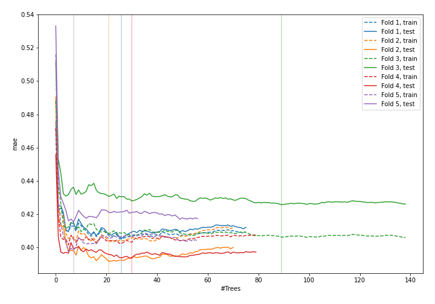
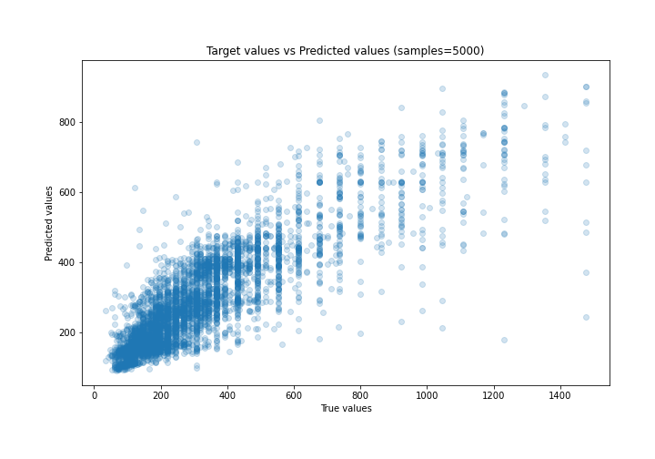
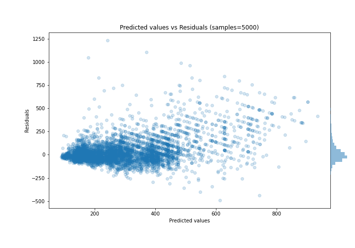

# Summary of 10_Default_ExtraTrees

[<< Go back](../README.md)

## Extra Trees Regressor (Extra Trees)
- **n_jobs**: -1
- **criterion**: mse
- **max_features**: 0.9
- **min_samples_split**: 30
- **max_depth**: 4
- **eval_metric_name**: mae
- **explain_level**: 0

## Validation
 - **validation_type**: kfold
 - **k_folds**: 5
 - **shuffle**: True

## Optimized metric
mae

## Training time

8.4 seconds

### Metric details:
| Metric   |       Score |
|:---------|------------:|
| MAE      |    82.6748  |
| MSE      | 18866       |
| RMSE     |   137.353   |
| R2       |     0.64628 |
| MAPE     |     0.26883 |

## Learning curves

## True vs Predicted

## Predicted vs Residuals

[<< Go back](../README.md)
