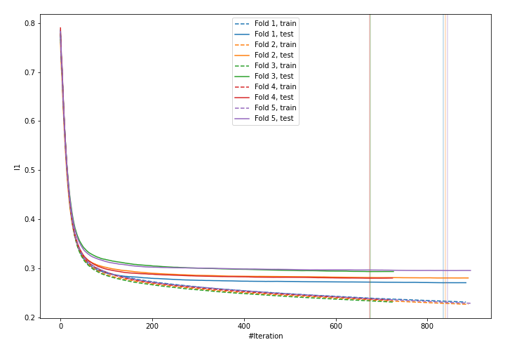
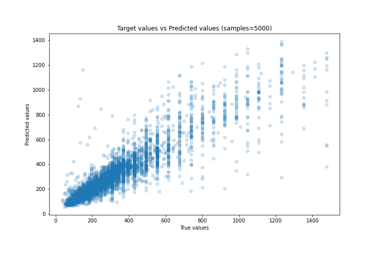
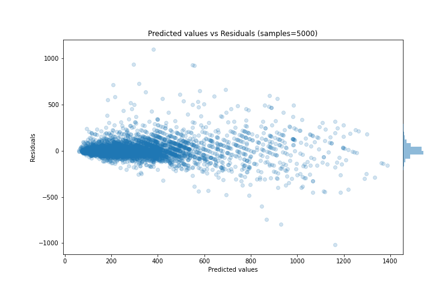

# Summary of 20_LightGBM

[<< Go back](../README.md)

## LightGBM
- **n_jobs**: -1
- **objective**: regression
- **num_leaves**: 15
- **learning_rate**: 0.05
- **feature_fraction**: 0.8
- **bagging_fraction**: 0.5
- **min_data_in_leaf**: 50
- **metric**: l1
- **custom_eval_metric_name**: None
- **explain_level**: 0

## Validation
 - **validation_type**: kfold
 - **k_folds**: 5
 - **shuffle**: True

## Optimized metric
mae

## Training time

8.4 seconds

### Metric details:
| Metric   |       Score |
|:---------|------------:|
| MAE      |   57.3328   |
| MSE      | 9600.39     |
| RMSE     |   97.9816   |
| R2       |    0.820001 |
| MAPE     |    0.186071 |

## Learning curves

## True vs Predicted

## Predicted vs Residuals

[<< Go back](../README.md)
