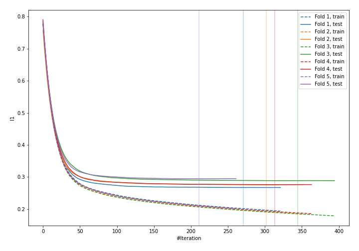
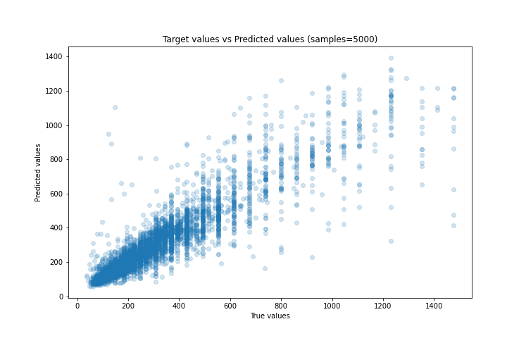

# Summary of 26_LightGBM

[<< Go back](../README.md)

## LightGBM
- **n_jobs**: -1
- **objective**: regression
- **num_leaves**: 63
- **learning_rate**: 0.05
- **feature_fraction**: 0.9
- **bagging_fraction**: 0.8
- **min_data_in_leaf**: 30
- **metric**: l1
- **custom_eval_metric_name**: None
- **explain_level**: 0

## Validation
 - **validation_type**: kfold
 - **k_folds**: 5
 - **shuffle**: True

## Optimized metric
mae

## Training time

10.5 seconds

### Metric details:
| Metric   |       Score |
|:---------|------------:|
| MAE      |   56.7432   |
| MSE      | 9494.14     |
| RMSE     |   97.4379   |
| R2       |    0.821993 |
| MAPE     |    0.183941 |

## Learning curves

## True vs Predicted

## Predicted vs Residuals

[<< Go back](../README.md)
