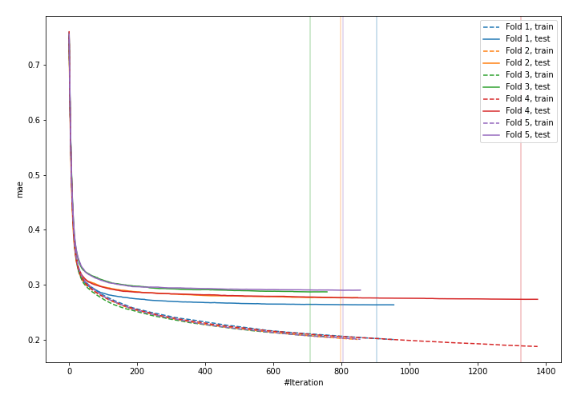
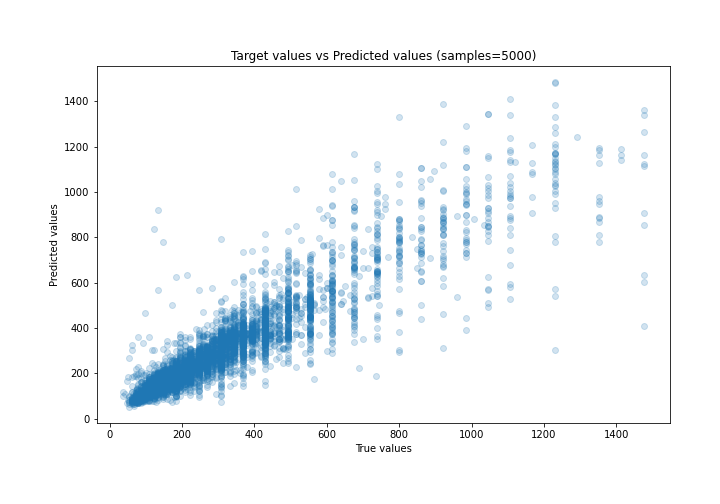
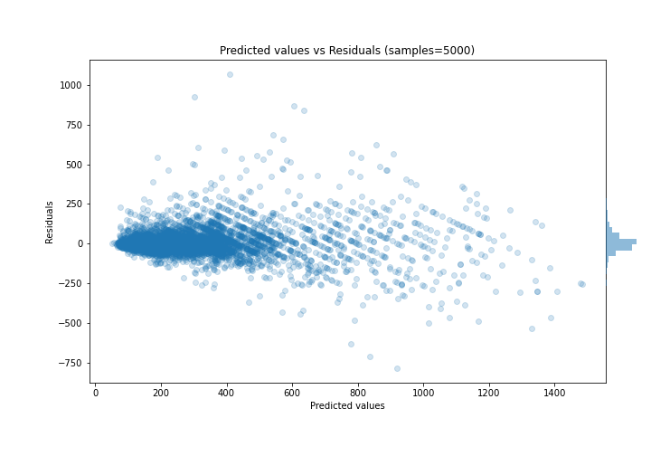

# Summary of 33_CatBoost

[<< Go back](../README.md)

## CatBoost
- **n_jobs**: -1
- **learning_rate**: 0.1
- **depth**: 6
- **rsm**: 0.7
- **loss_function**: MAE
- **eval_metric**: MAE
- **explain_level**: 0

## Validation
 - **validation_type**: kfold
 - **k_folds**: 5
 - **shuffle**: True

## Optimized metric
mae

## Training time

19.2 seconds

### Metric details:
| Metric   |       Score |
|:---------|------------:|
| MAE      |   56.3935   |
| MSE      | 9436.37     |
| RMSE     |   97.141    |
| R2       |    0.823077 |
| MAPE     |    0.181671 |

## Learning curves

## True vs Predicted

## Predicted vs Residuals

[<< Go back](../README.md)
