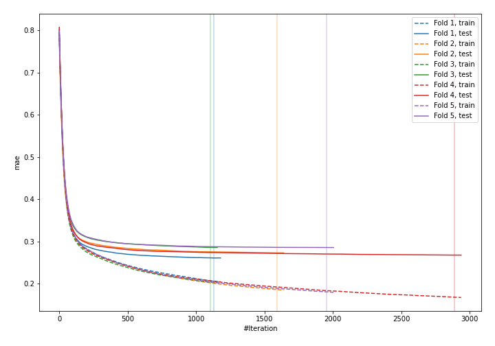
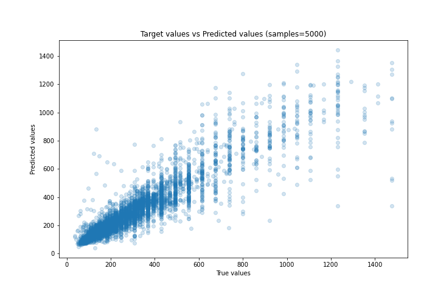
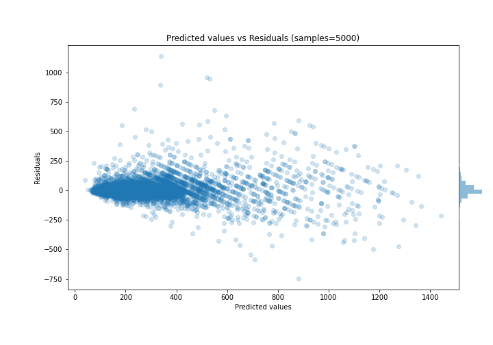

# Summary of 35_CatBoost

[<< Go back](../README.md)

## CatBoost
- **n_jobs**: -1
- **learning_rate**: 0.025
- **depth**: 8
- **rsm**: 1.0
- **loss_function**: MAE
- **eval_metric**: MAE
- **explain_level**: 0

## Validation
 - **validation_type**: kfold
 - **k_folds**: 5
 - **shuffle**: True

## Optimized metric
mae

## Training time

43.3 seconds

### Metric details:
| Metric   |       Score |
|:---------|------------:|
| MAE      |   55.7418   |
| MSE      | 9300.24     |
| RMSE     |   96.4377   |
| R2       |    0.825629 |
| MAPE     |    0.178778 |

## Learning curves

## True vs Predicted

## Predicted vs Residuals

[<< Go back](../README.md)
