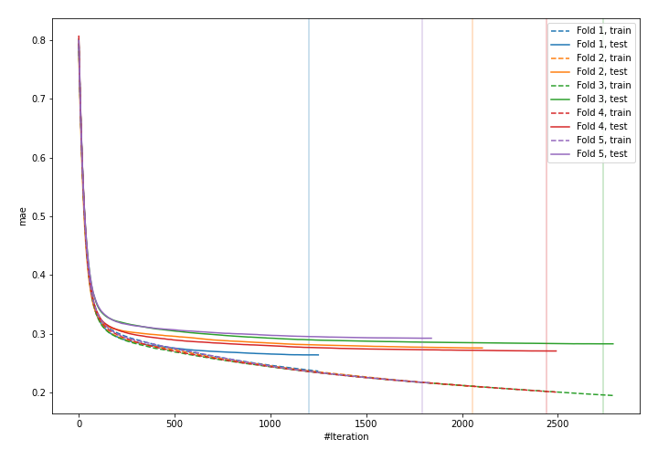
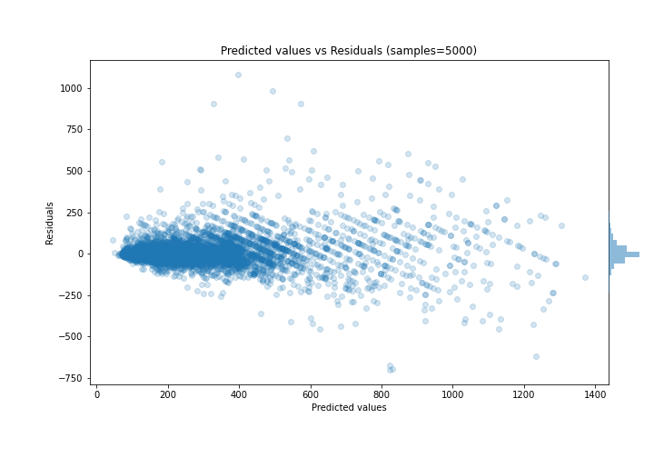

# Summary of 37_CatBoost

[<< Go back](../README.md)

## CatBoost
- **n_jobs**: -1
- **learning_rate**: 0.025
- **depth**: 7
- **rsm**: 0.7
- **loss_function**: RMSE
- **eval_metric**: MAE
- **explain_level**: 0

## Validation
 - **validation_type**: kfold
 - **k_folds**: 5
 - **shuffle**: True

## Optimized metric
mae

## Training time

46.1 seconds

### Metric details:
| Metric   |       Score |
|:---------|------------:|
| MAE      |   55.9958   |
| MSE      | 9182.73     |
| RMSE     |   95.8265   |
| R2       |    0.827832 |
| MAPE     |    0.18126  |

## Learning curves

## True vs Predicted

## Predicted vs Residuals

[<< Go back](../README.md)
