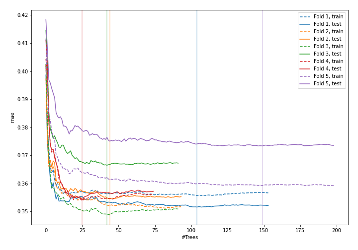
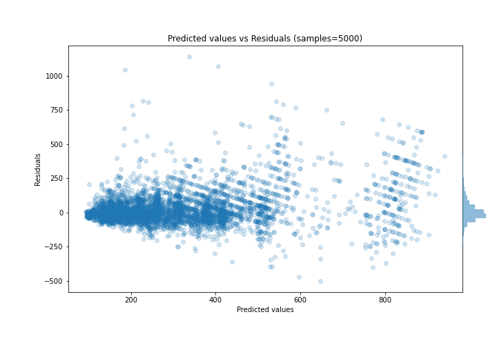

# Summary of 38_RandomForest

[<< Go back](../README.md)

## Random Forest
- **n_jobs**: -1
- **criterion**: mse
- **max_features**: 0.5
- **min_samples_split**: 20
- **max_depth**: 4
- **eval_metric_name**: mae
- **explain_level**: 0

## Validation
 - **validation_type**: kfold
 - **k_folds**: 5
 - **shuffle**: True

## Optimized metric
mae

## Training time

9.6 seconds

### Metric details:
| Metric   |        Score |
|:---------|-------------:|
| MAE      |    72.8196   |
| MSE      | 15057.9      |
| RMSE     |   122.711    |
| R2       |     0.717678 |
| MAPE     |     0.236797 |

## Learning curves

## True vs Predicted

## Predicted vs Residuals

[<< Go back](../README.md)
