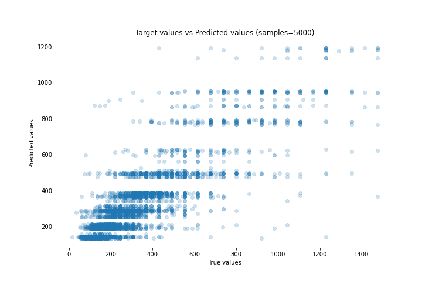

# Summary of 3_DecisionTree

[<< Go back](../README.md)

## Decision Tree
- **n_jobs**: -1
- **criterion**: mse
- **max_depth**: 4
- **explain_level**: 0

## Validation
 - **validation_type**: kfold
 - **k_folds**: 5
 - **shuffle**: True

## Optimized metric
mae

## Training time

5.9 seconds

### Metric details:
| Metric   |        Score |
|:---------|-------------:|
| MAE      |    78.8031   |
| MSE      | 14965.6      |
| RMSE     |   122.334    |
| R2       |     0.719416 |
| MAPE     |     0.295298 |

## Learning curves

## True vs Predicted

## Predicted vs Residuals

[<< Go back](../README.md)
