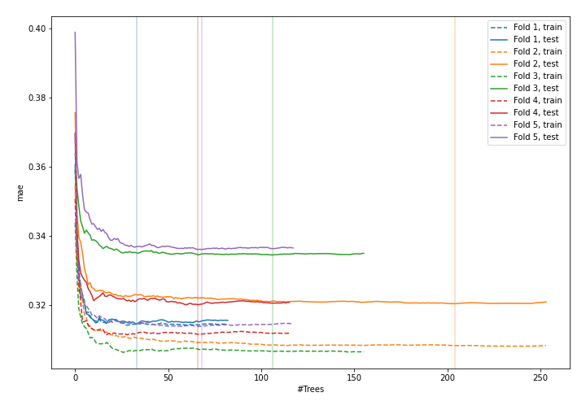
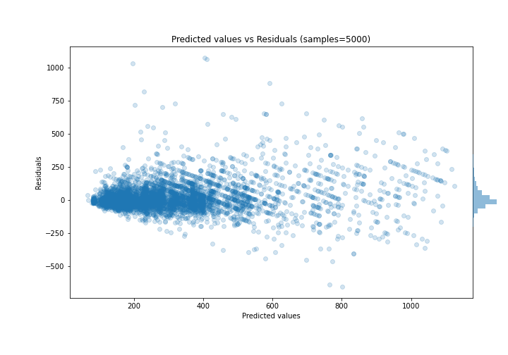

# Summary of 41_RandomForest

[<< Go back](../README.md)

## Random Forest
- **n_jobs**: -1
- **criterion**: mse
- **max_features**: 0.6
- **min_samples_split**: 50
- **max_depth**: 6
- **eval_metric_name**: mae
- **explain_level**: 0

## Validation
 - **validation_type**: kfold
 - **k_folds**: 5
 - **shuffle**: True

## Optimized metric
mae

## Training time

11.2 seconds

### Metric details:
| Metric   |        Score |
|:---------|-------------:|
| MAE      |    64.8463   |
| MSE      | 11772.9      |
| RMSE     |   108.503    |
| R2       |     0.779269 |
| MAPE     |     0.213706 |

## Learning curves

## True vs Predicted

## Predicted vs Residuals

[<< Go back](../README.md)
