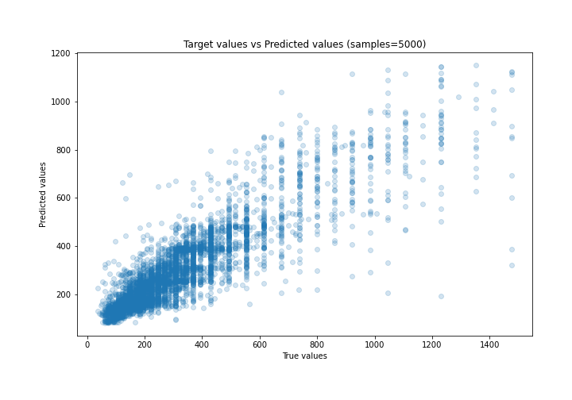
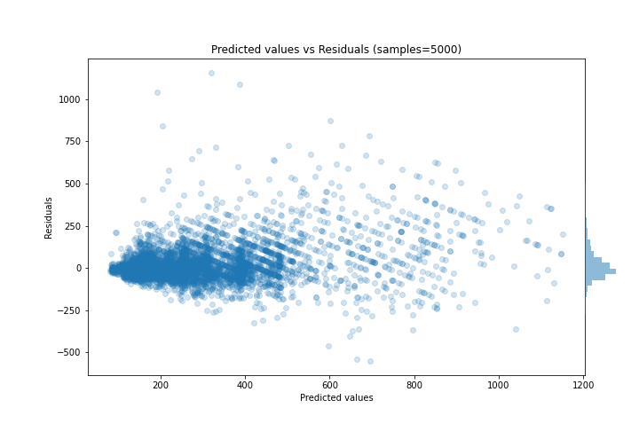

# Summary of 49_ExtraTrees

[<< Go back](../README.md)

## Extra Trees Regressor (Extra Trees)
- **n_jobs**: -1
- **criterion**: mse
- **max_features**: 1.0
- **min_samples_split**: 40
- **max_depth**: 6
- **eval_metric_name**: mae
- **explain_level**: 0

## Validation
 - **validation_type**: kfold
 - **k_folds**: 5
 - **shuffle**: True

## Optimized metric
mae

## Training time

10.1 seconds

### Metric details:
| Metric   |        Score |
|:---------|-------------:|
| MAE      |    70.6659   |
| MSE      | 13527.5      |
| RMSE     |   116.308    |
| R2       |     0.746371 |
| MAPE     |     0.234531 |

## Learning curves

## True vs Predicted

## Predicted vs Residuals

[<< Go back](../README.md)
