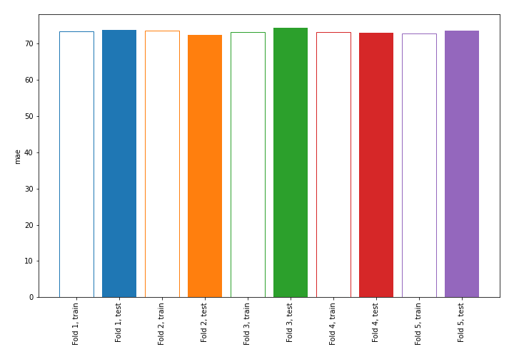
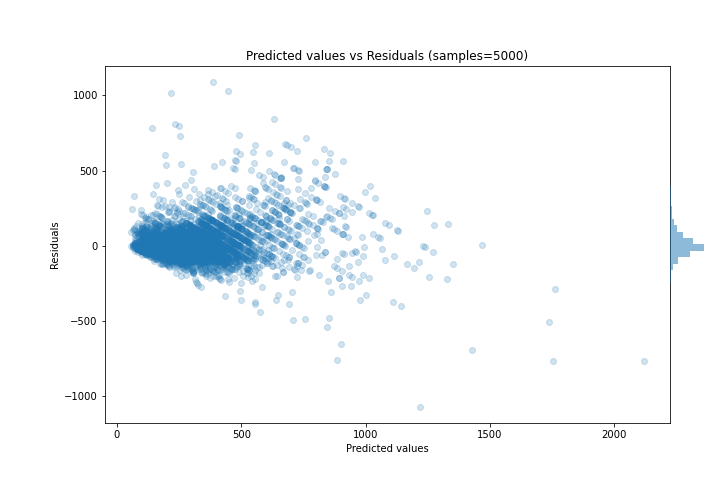

# Summary of 4_Linear

[<< Go back](../README.md)

## Linear Regression (Linear)
- **n_jobs**: -1
- **explain_level**: 0

## Validation
 - **validation_type**: kfold
 - **k_folds**: 5
 - **shuffle**: True

## Optimized metric
mae

## Training time

6.1 seconds

### Metric details:
| Metric   |        Score |
|:---------|-------------:|
| MAE      |    73.428    |
| MSE      | 14545.5      |
| RMSE     |   120.605    |
| R2       |     0.727285 |
| MAPE     |     0.242978 |

## Learning curves

## True vs Predicted

## Predicted vs Residuals

[<< Go back](../README.md)
