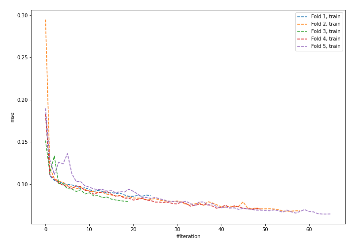
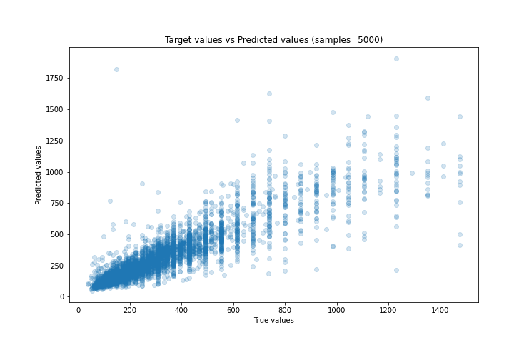
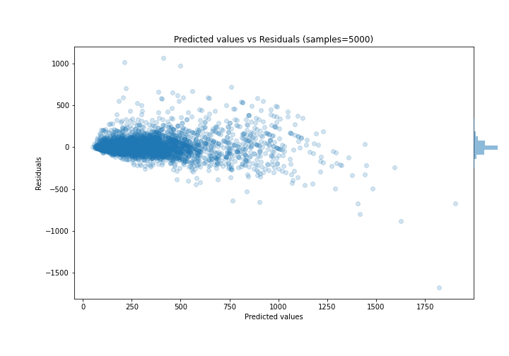

# Summary of 57_NeuralNetwork

[<< Go back](../README.md)

## Neural Network
- **n_jobs**: -1
- **dense_1_size**: 64
- **dense_2_size**: 16
- **learning_rate**: 0.01
- **explain_level**: 0

## Validation
 - **validation_type**: kfold
 - **k_folds**: 5
 - **shuffle**: True

## Optimized metric
mae

## Training time

15.8 seconds

### Metric details:
| Metric   |        Score |
|:---------|-------------:|
| MAE      |    63.1149   |
| MSE      | 11980.3      |
| RMSE     |   109.455    |
| R2       |     0.77538  |
| MAPE     |     0.206181 |

## Learning curves

## True vs Predicted

## Predicted vs Residuals

[<< Go back](../README.md)
