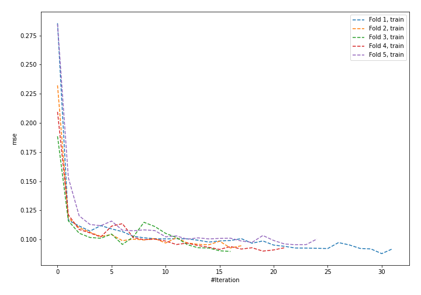
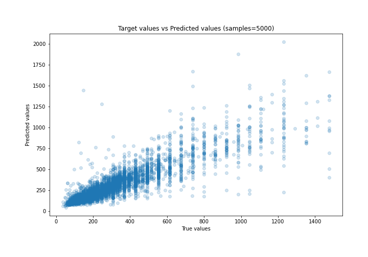
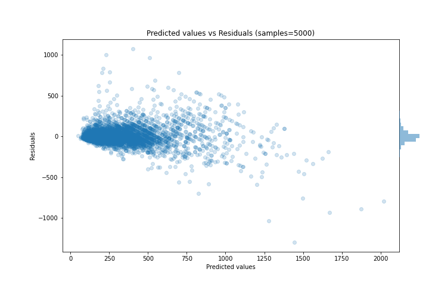

# Summary of 59_NeuralNetwork

[<< Go back](../README.md)

## Neural Network
- **n_jobs**: -1
- **dense_1_size**: 32
- **dense_2_size**: 32
- **learning_rate**: 0.05
- **explain_level**: 0

## Validation
 - **validation_type**: kfold
 - **k_folds**: 5
 - **shuffle**: True

## Optimized metric
mae

## Training time

9.6 seconds

### Metric details:
| Metric   |        Score |
|:---------|-------------:|
| MAE      |    65.5246   |
| MSE      | 12931.3      |
| RMSE     |   113.716    |
| R2       |     0.75755  |
| MAPE     |     0.217151 |

## Learning curves

## True vs Predicted

## Predicted vs Residuals

[<< Go back](../README.md)
