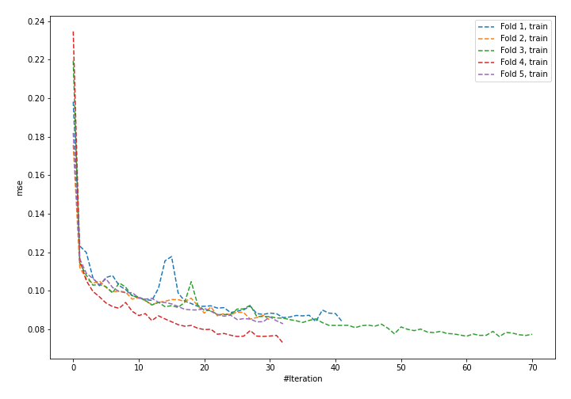
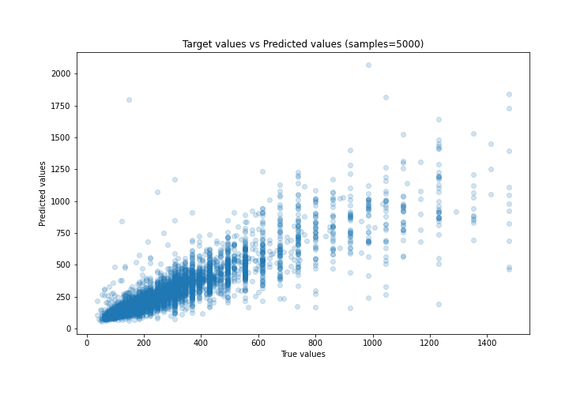
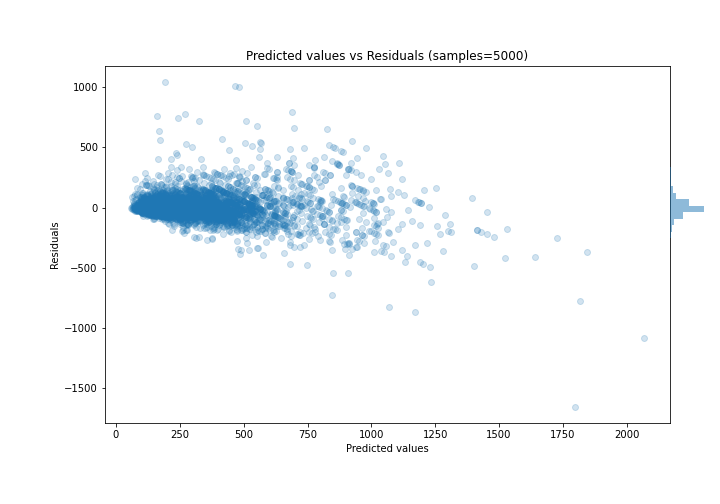

# Summary of 61_NeuralNetwork

[<< Go back](../README.md)

## Neural Network
- **n_jobs**: -1
- **dense_1_size**: 64
- **dense_2_size**: 4
- **learning_rate**: 0.01
- **explain_level**: 0

## Validation
 - **validation_type**: kfold
 - **k_folds**: 5
 - **shuffle**: True

## Optimized metric
mae

## Training time

14.5 seconds

### Metric details:
| Metric   |        Score |
|:---------|-------------:|
| MAE      |    64.559    |
| MSE      | 13284.2      |
| RMSE     |   115.257    |
| R2       |     0.750933 |
| MAPE     |     0.208975 |

## Learning curves

## True vs Predicted

## Predicted vs Residuals

[<< Go back](../README.md)
