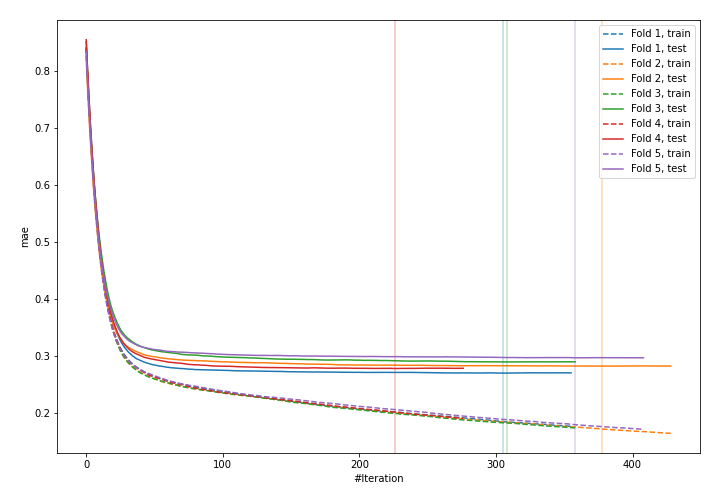
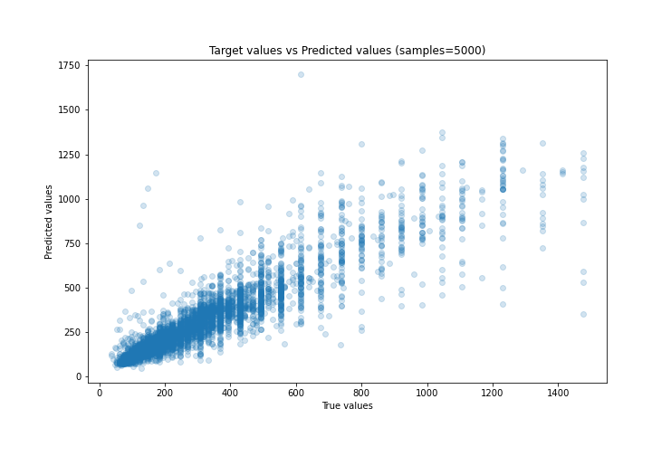
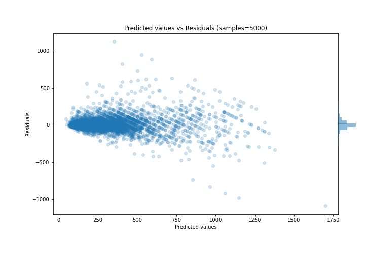

# Summary of 6_Default_Xgboost

[<< Go back](../README.md)

## Extreme Gradient Boosting (Xgboost)
- **n_jobs**: -1
- **objective**: reg:squarederror
- **eta**: 0.075
- **max_depth**: 6
- **min_child_weight**: 1
- **subsample**: 1.0
- **colsample_bytree**: 1.0
- **eval_metric**: mae
- **explain_level**: 0

## Validation
 - **validation_type**: kfold
 - **k_folds**: 5
 - **shuffle**: True

## Optimized metric
mae

## Training time

9.7 seconds

### Metric details:
| Metric   |       Score |
|:---------|------------:|
| MAE      |   57.2611   |
| MSE      | 9715.61     |
| RMSE     |   98.5678   |
| R2       |    0.817841 |
| MAPE     |    0.186068 |

## Learning curves

## True vs Predicted

## Predicted vs Residuals

[<< Go back](../README.md)
