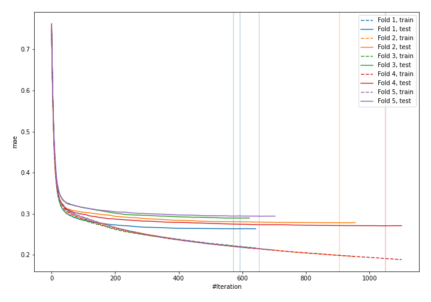
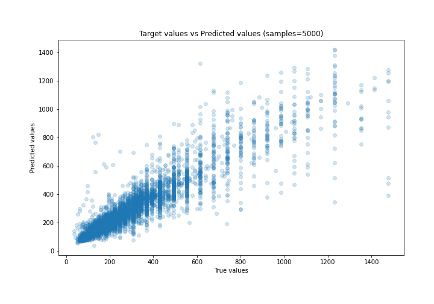
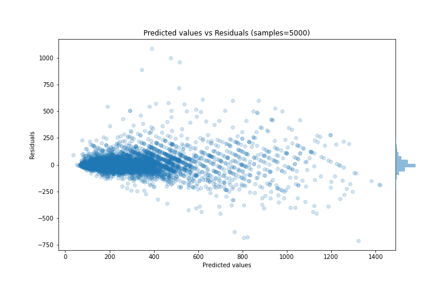

# Summary of 7_Default_CatBoost

[<< Go back](../README.md)

## CatBoost
- **n_jobs**: -1
- **learning_rate**: 0.1
- **depth**: 6
- **rsm**: 1
- **loss_function**: RMSE
- **eval_metric**: MAE
- **explain_level**: 0

## Validation
 - **validation_type**: kfold
 - **k_folds**: 5
 - **shuffle**: True

## Optimized metric
mae

## Training time

14.0 seconds

### Metric details:
| Metric   |       Score |
|:---------|------------:|
| MAE      |   56.3431   |
| MSE      | 9276.42     |
| RMSE     |   96.3142   |
| R2       |    0.826075 |
| MAPE     |    0.182825 |

## Learning curves

## True vs Predicted

## Predicted vs Residuals

[<< Go back](../README.md)
