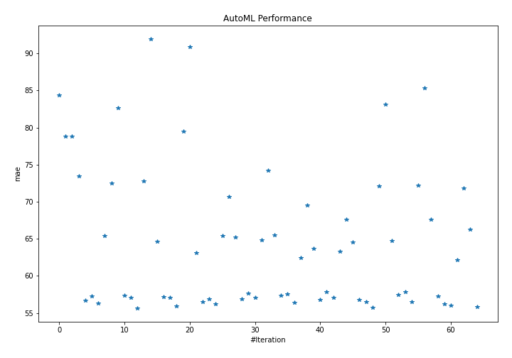
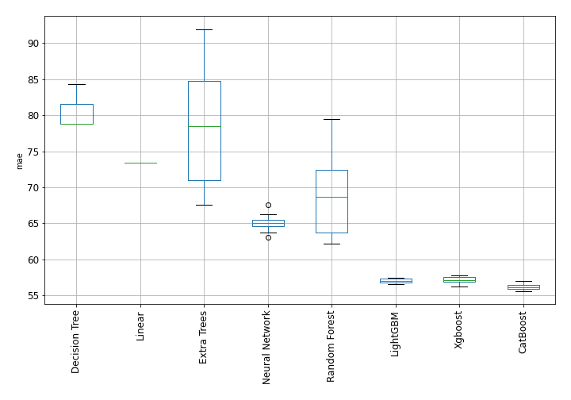

# AutoML Leaderboard

| Best model   | name                                                               | model_type     | metric_type   |   metric_value |   train_time |
|:-------------|:-------------------------------------------------------------------|:---------------|:--------------|---------------:|-------------:|
|              | [1_DecisionTree](1_DecisionTree/README.md)                         | Decision Tree  | mae           |        84.3395 |         8.83 |
|              | [2_DecisionTree](2_DecisionTree/README.md)                         | Decision Tree  | mae           |        78.8031 |         6.07 |
|              | [3_DecisionTree](3_DecisionTree/README.md)                         | Decision Tree  | mae           |        78.8031 |         6.14 |
|              | [4_Linear](4_Linear/README.md)                                     | Linear         | mae           |        73.428  |         6.37 |
|              | [5_Default_LightGBM](5_Default_LightGBM/README.md)                 | LightGBM       | mae           |        56.6648 |         9.31 |
|              | [6_Default_Xgboost](6_Default_Xgboost/README.md)                   | Xgboost        | mae           |        57.2611 |        10.51 |
|              | [7_Default_CatBoost](7_Default_CatBoost/README.md)                 | CatBoost       | mae           |        56.3431 |        14.86 |
|              | [8_Default_NeuralNetwork](8_Default_NeuralNetwork/README.md)       | Neural Network | mae           |        65.3727 |         9.18 |
|              | [9_Default_RandomForest](9_Default_RandomForest/README.md)         | Random Forest  | mae           |        72.4966 |        10.32 |
|              | [10_Default_ExtraTrees](10_Default_ExtraTrees/README.md)           | Extra Trees    | mae           |        82.6748 |         9.19 |
|              | [20_LightGBM](20_LightGBM/README.md)                               | LightGBM       | mae           |        57.3328 |         9.21 |
|              | [11_Xgboost](11_Xgboost/README.md)                                 | Xgboost        | mae           |        57.0494 |        10.27 |
| **the best** | [29_CatBoost](29_CatBoost/README.md)                               | CatBoost       | mae           |        55.6253 |        72.65 |
|              | [38_RandomForest](38_RandomForest/README.md)                       | Random Forest  | mae           |        72.8196 |        10.36 |
|              | [47_ExtraTrees](47_ExtraTrees/README.md)                           | Extra Trees    | mae           |        91.9436 |        11.39 |
|              | [56_NeuralNetwork](56_NeuralNetwork/README.md)                     | Neural Network | mae           |        64.673  |        10.95 |
|              | [21_LightGBM](21_LightGBM/README.md)                               | LightGBM       | mae           |        57.1438 |         8.27 |
|              | [12_Xgboost](12_Xgboost/README.md)                                 | Xgboost        | mae           |        57.0738 |        11.11 |
|              | [30_CatBoost](30_CatBoost/README.md)                               | CatBoost       | mae           |        55.9017 |        19.61 |
|              | [39_RandomForest](39_RandomForest/README.md)                       | Random Forest  | mae           |        79.4757 |        11.23 |
|              | [48_ExtraTrees](48_ExtraTrees/README.md)                           | Extra Trees    | mae           |        90.8528 |         9.25 |
|              | [57_NeuralNetwork](57_NeuralNetwork/README.md)                     | Neural Network | mae           |        63.1149 |        16.31 |
|              | [22_LightGBM](22_LightGBM/README.md)                               | LightGBM       | mae           |        56.5362 |        10.07 |
|              | [13_Xgboost](13_Xgboost/README.md)                                 | Xgboost        | mae           |        56.8815 |        10.33 |
|              | [31_CatBoost](31_CatBoost/README.md)                               | CatBoost       | mae           |        56.1909 |        16.56 |
|              | [40_RandomForest](40_RandomForest/README.md)                       | Random Forest  | mae           |        65.3579 |        11.36 |
|              | [49_ExtraTrees](49_ExtraTrees/README.md)                           | Extra Trees    | mae           |        70.6659 |        10.85 |
|              | [58_NeuralNetwork](58_NeuralNetwork/README.md)                     | Neural Network | mae           |        65.2432 |        15.33 |
|              | [23_LightGBM](23_LightGBM/README.md)                               | LightGBM       | mae           |        56.8703 |        10.02 |
|              | [14_Xgboost](14_Xgboost/README.md)                                 | Xgboost        | mae           |        57.6214 |         9.7  |
|              | [32_CatBoost](32_CatBoost/README.md)                               | CatBoost       | mae           |        57.0466 |        14.98 |
|              | [41_RandomForest](41_RandomForest/README.md)                       | Random Forest  | mae           |        64.8463 |        12.01 |
|              | [50_ExtraTrees](50_ExtraTrees/README.md)                           | Extra Trees    | mae           |        74.2461 |        10.22 |
|              | [59_NeuralNetwork](59_NeuralNetwork/README.md)                     | Neural Network | mae           |        65.5246 |        10.12 |
|              | [24_LightGBM](24_LightGBM/README.md)                               | LightGBM       | mae           |        57.3269 |         8.64 |
|              | [15_Xgboost](15_Xgboost/README.md)                                 | Xgboost        | mae           |        57.5869 |        10.58 |
|              | [33_CatBoost](33_CatBoost/README.md)                               | CatBoost       | mae           |        56.3935 |        20.04 |
|              | [42_RandomForest](42_RandomForest/README.md)                       | Random Forest  | mae           |        62.4755 |        13.13 |
|              | [51_ExtraTrees](51_ExtraTrees/README.md)                           | Extra Trees    | mae           |        69.4759 |        11.65 |
|              | [60_NeuralNetwork](60_NeuralNetwork/README.md)                     | Neural Network | mae           |        63.6826 |        14.36 |
|              | [25_LightGBM](25_LightGBM/README.md)                               | LightGBM       | mae           |        56.81   |        10.82 |
|              | [16_Xgboost](16_Xgboost/README.md)                                 | Xgboost        | mae           |        57.8449 |        12.12 |
|              | [34_CatBoost](34_CatBoost/README.md)                               | CatBoost       | mae           |        57.063  |        20.51 |
|              | [43_RandomForest](43_RandomForest/README.md)                       | Random Forest  | mae           |        63.3199 |        13.3  |
|              | [52_ExtraTrees](52_ExtraTrees/README.md)                           | Extra Trees    | mae           |        67.5637 |        12.1  |
|              | [61_NeuralNetwork](61_NeuralNetwork/README.md)                     | Neural Network | mae           |        64.559  |        15.01 |
|              | [26_LightGBM](26_LightGBM/README.md)                               | LightGBM       | mae           |        56.7432 |        11.42 |
|              | [17_Xgboost](17_Xgboost/README.md)                                 | Xgboost        | mae           |        56.4899 |        12.56 |
|              | [35_CatBoost](35_CatBoost/README.md)                               | CatBoost       | mae           |        55.7418 |        44.1  |
|              | [44_RandomForest](44_RandomForest/README.md)                       | Random Forest  | mae           |        72.079  |        11.76 |
|              | [53_ExtraTrees](53_ExtraTrees/README.md)                           | Extra Trees    | mae           |        83.1416 |        10.58 |
|              | [62_NeuralNetwork](62_NeuralNetwork/README.md)                     | Neural Network | mae           |        64.7583 |        12.61 |
|              | [27_LightGBM](27_LightGBM/README.md)                               | LightGBM       | mae           |        57.4375 |        10.49 |
|              | [18_Xgboost](18_Xgboost/README.md)                                 | Xgboost        | mae           |        57.8355 |        10.97 |
|              | [36_CatBoost](36_CatBoost/README.md)                               | CatBoost       | mae           |        56.5164 |        21.42 |
|              | [45_RandomForest](45_RandomForest/README.md)                       | Random Forest  | mae           |        72.2311 |        11.66 |
|              | [54_ExtraTrees](54_ExtraTrees/README.md)                           | Extra Trees    | mae           |        85.3084 |        10.07 |
|              | [63_NeuralNetwork](63_NeuralNetwork/README.md)                     | Neural Network | mae           |        67.6285 |        12.23 |
|              | [28_LightGBM](28_LightGBM/README.md)                               | LightGBM       | mae           |        57.2513 |        11    |
|              | [19_Xgboost](19_Xgboost/README.md)                                 | Xgboost        | mae           |        56.2174 |        12.74 |
|              | [37_CatBoost](37_CatBoost/README.md)                               | CatBoost       | mae           |        55.9958 |        46.97 |
|              | [46_RandomForest](46_RandomForest/README.md)                       | Random Forest  | mae           |        62.1793 |        13.28 |
|              | [55_ExtraTrees](55_ExtraTrees/README.md)                           | Extra Trees    | mae           |        71.8621 |        11.76 |
|              | [64_NeuralNetwork](64_NeuralNetwork/README.md)                     | Neural Network | mae           |        66.268  |        10.85 |
|              | [29_CatBoost_GoldenFeatures](29_CatBoost_GoldenFeatures/README.md) | CatBoost       | mae           |        55.8592 |       100.37 |

### AutoML Performance

### AutoML Performance Boxplot
